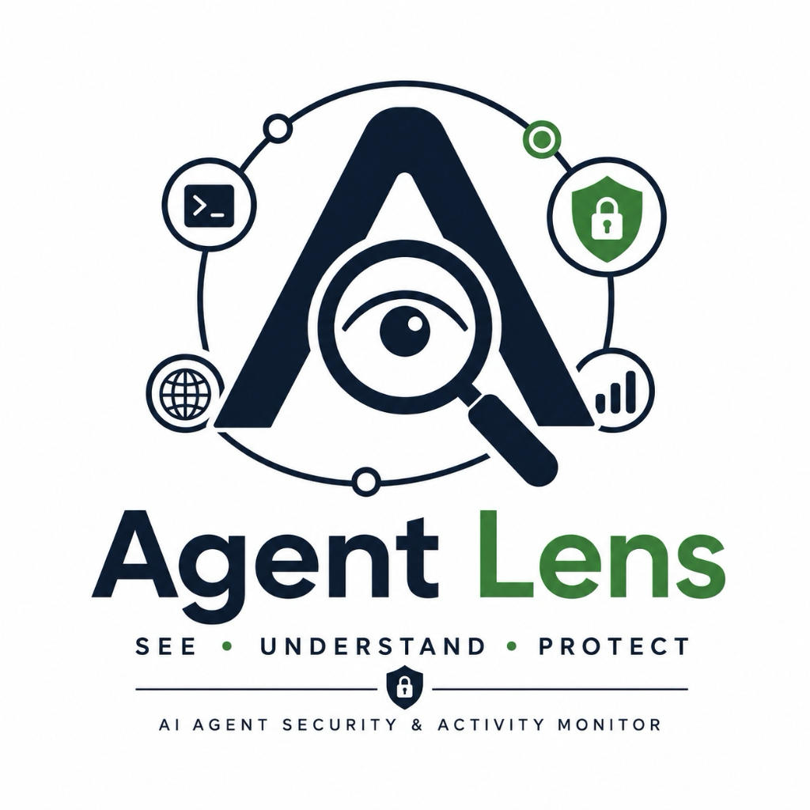
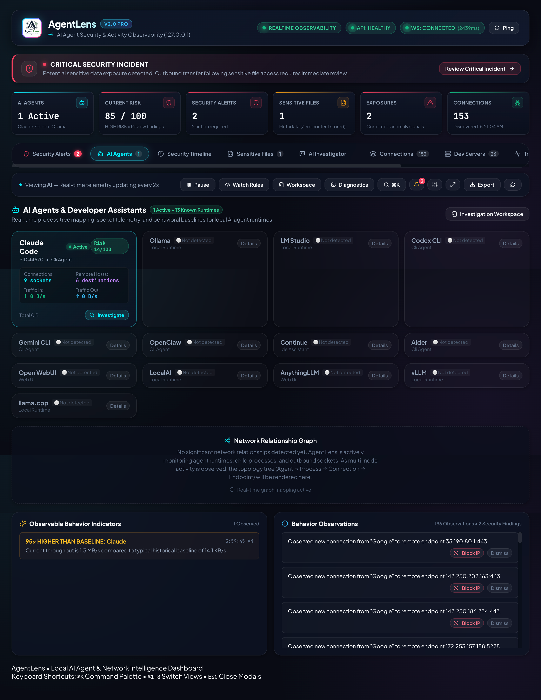
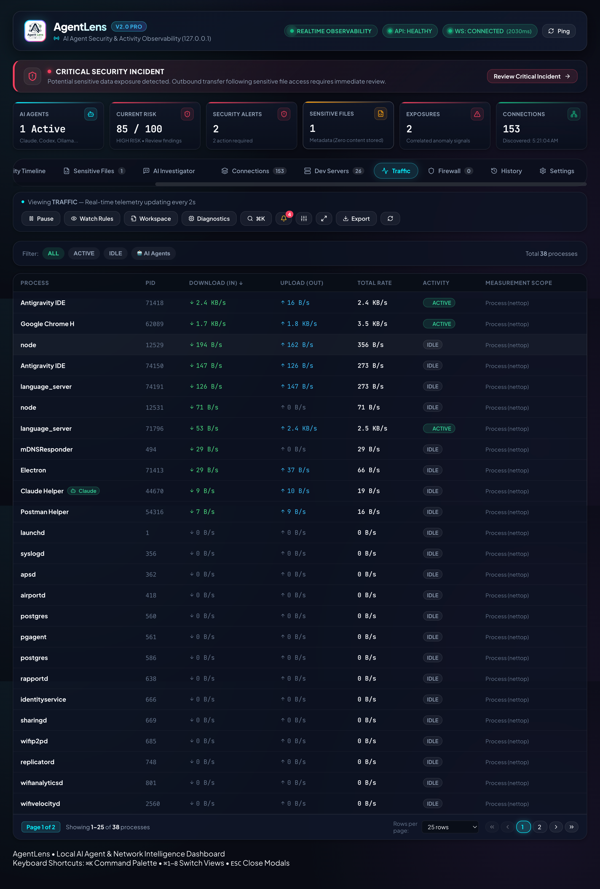
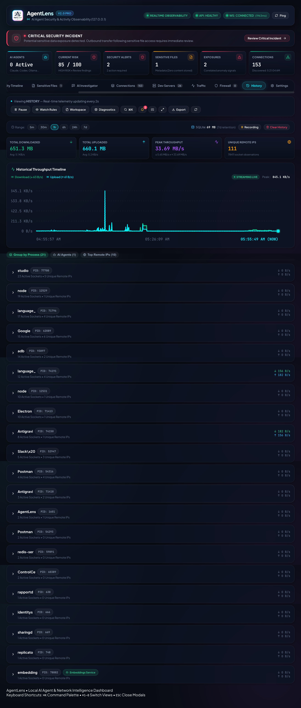

# Agent Lens

### AI Agent Security & Activity Monitor

*Understand what AI agents and developer tools are doing on your computer.*

---

## 🖥️ See Agent Lens in Action

Agent Lens provides real-time visibility into AI agents, processes,
network connections, traffic, sensitive resource access, and
security-related behavior — entirely on your local machine.

> **Screenshots may contain sample or simulated telemetry for demonstration purposes.**

### AI Agent Monitoring

### Security Investigation

### Network Connections

### Traffic & Behavior

### History

---