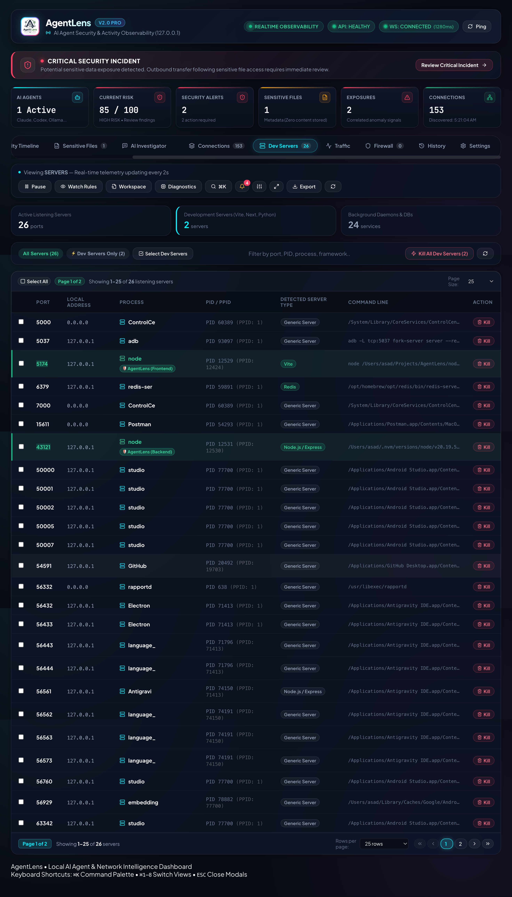

<div align="center">


# Agent Lens

### AI Agent Security & Activity Monitor

*Understand and protect what AI agents and developer tools are doing on your computer.*

[]()
[]()
[]()
[](LICENSE)

</div>

---

## 🖥️ See Agent Lens in Action



Agent Lens provides real-time visibility into AI agents, processes, network connections, traffic, sensitive resource access, and security-related behavior — entirely on your local machine.

> **Note:** Telemetry and traffic visualizations run strictly locally on 127.0.0.1.

### AI Agent Monitoring & Graph


### Security Investigation & Alerting


### Traffic & Behavior Analytics


### Historical Auditing


---

## ✨ Key Features

- 🤖 **AI Agent & LLM Detection**: Automatically detects AI coding agents, autonomous background workers (Claude Code, Cursor, Copilot, Cline, Ollama, LangChain, etc.), and analyzes their activity.
- 🔒 **Security & Incident Investigation**: Real-time alerting on anomalous network access, sensitive file touching (`.env`, `.ssh`, `.aws`, credentials), port scans, and suspicious outbound endpoints.
- ⚡ **Real-Time Network Telemetry**: Live per-process packet bandwidth (in/out), active TCP/UDP sockets, remote endpoints, and country geolocation lookup.
- 🧠 **Local AI Security Analyst**: Query your system's network state in natural language powered by a local Ollama instance (e.g. `llama3.2`) with zero data leaving your machine.
- 🍏 **Native macOS Control Center**: Dedicated Swift + WebKit GUI launcher with single-click start/stop, pre-flight diagnostics, and port management.
- 🪟 **Cross-Platform Support**: Built-in native platform providers for both macOS (`lsof`, `nettop`, `pfctl`) and Windows (`netstat`, `Get-NetTCPConnection`, PowerShell).
- 🛡️ **Safe Simulation Mode**: Built-in Dry-Run simulation engine to safely test rules and mitigations without touching system networking.

---

## 🚀 Quick Start

### macOS (One-Click Launcher)
Double-click **`start-ui.command`** or build the native GUI:
```bash
npm run launcher
```
*Or launch via terminal:*
```bash
./start.command
```

### Windows
Double-click **`start.bat`** or run PowerShell launcher:
```powershell
.\start.ps1
```

### Manual Development Setup
```bash
# 1. Install dependencies
npm install

# 2. Build shared packages
npm run build --workspace=@network-monitor/shared

# 3. Start development servers
npm run dev
```

Dashboard will be live at: **`http://127.0.0.1:5174`**  
Backend API will be live at: **`http://127.0.0.1:43121`**

---

## ⚙️ Configuration (`.env`)

| Variable | Default | Description |
|---|---|---|
| `PORT` | `43121` | Backend HTTP & WebSocket server port |
| `FRONTEND_PORT` | `5174` | Vite frontend UI dashboard port |
| `HOST` | `127.0.0.1` | Loopback binding address |
| `ENABLE_DRY_RUN_MODE` | `true` | Simulation mode for security actions |
| `LLM_ENABLED` | `false` | Enable local LLM query assistant |
| `OLLAMA_ENDPOINT` | `http://127.0.0.1:11434` | Local Ollama API endpoint |
| `OLLAMA_MODEL` | `llama3.2:latest` | Target Ollama model name |

---

## 🧪 Testing

```bash
# Run all unit and integration test suites
npm test

# Run type checks
npm run test --workspaces
```

---

## 🔒 Privacy & Security

Agent Lens is designed with a privacy-first architecture:
- **100% Local Execution**: All telemetry, SQLite storage, and analytics execute exclusively on `127.0.0.1`.
- **Zero External Telemetry**: No user data, network packets, or process metadata is ever sent to external cloud servers.
- **Local AI**: Natural language analysis runs through local Ollama models on your GPU/CPU.

---

## 📄 License

Distributed under the MIT License. See [LICENSE](LICENSE) for more information.